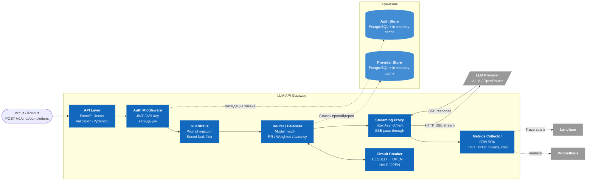

# C4 Component Diagram — LLM API Gateway

Внутреннее устройство ядра системы — LLM API Gateway.



## Пайплайн обработки запроса

```
Request → API Layer → Auth → Guardrails → Router ←→ Circuit Breaker
                                            │
                                            ↓
                                      Streaming Proxy → LLM Provider
                                            │
                                      Metrics Collector → Prometheus / Langfuse
```

## Компоненты

| Компонент | Ответственность | Stateful? |
|---|---|---|
| API Layer | HTTP routing, validation (Pydantic) | Нет |
| Auth Middleware | JWT decode / API-key lookup | Нет (читает из Auth Store) |
| Guardrails | Regex + LLM classifier, блокировка | Нет |
| Router / Balancer | Выбор провайдера по стратегии | Да (EMA latency в памяти) |
| Circuit Breaker | Tracking health state провайдеров | Да (state в памяти) |
| Streaming Proxy | httpx SSE pass-through | Нет |
| Metrics Collector | Counters, histograms, traces | Да (OTel SDK буфер) |
| Provider Store | Кэш + PostgreSQL sync | Да (in-memory cache, TTL 30s) |
| Auth Store | Кэш + PostgreSQL | Да (in-memory cache) |
