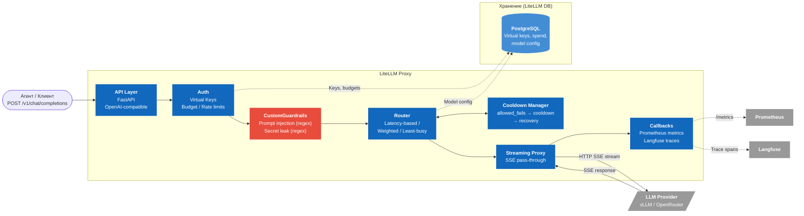

# C4 Component Diagram — LLM API Gateway (LiteLLM Proxy)

Внутреннее устройство LiteLLM Proxy с нашими кастомными guardrails.



**Легенда:** Синий = LiteLLM built-in, Красный = наш кастомный код, Серый = внешние сервисы.

## Пайплайн обработки запроса

```
Request → API Layer → Auth (virtual key) → CustomGuardrails → Router ←→ Cooldown Manager
                                                                 │
                                                                 ↓
                                                          Streaming Proxy → LLM Provider
                                                                 │
                                                          Callbacks → Prometheus / Langfuse
```

## Что LiteLLM built-in vs наш код

| Компонент | LiteLLM built-in | Наш код |
|---|---|---|
| API Layer (OpenAI-compatible) | Да | — |
| Auth (virtual keys, budgets, rate limits) | Да | — |
| **Guardrails** (prompt injection, secret leak) | — | **`custom_guardrail.py`** |
| Router (latency-based, weighted, etc.) | Да | — |
| Cooldown / Failover | Да | — |
| Streaming Proxy | Да | — |
| Prometheus metrics | Да (callback) | — |
| Langfuse traces | Да (callback) | — |
| TPOT metric | — | **CustomLogger callback** (опционально) |
