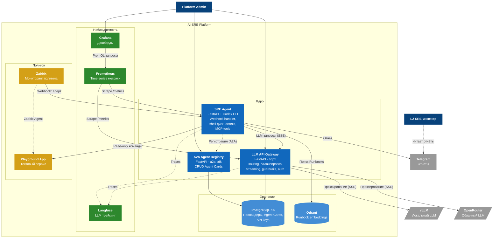

# C4 Container Diagram — AI-SRE Platform

Внутренняя структура платформы: контейнеры, их роли и связи.

## Контейнеры и порты

| Контейнер | Технология | Порт | Цвет на диаграмме |
|---|---|---|---|
| `llm-gateway` | Python 3.12, FastAPI, httpx | 8000 | Синий (core) |
| `agent-registry` | Python 3.12, FastAPI, a2a-sdk | 8001 | Синий (core) |
| `sre-agent` | Python 3.12, FastAPI + Codex CLI | 8002 | Синий (core) |
| `postgres` | PostgreSQL 16 | 5432 | Голубой (storage) |
| `qdrant` | Qdrant | 6333 | Голубой (storage) |
| `prometheus` | Prometheus | 9090 | Зелёный (observability) |
| `grafana` | Grafana | 3000 | Зелёный (observability) |
| `langfuse` | Langfuse (self-hosted) | 3001 | Зелёный (observability) |
| `zabbix-server` + `zabbix-web` | Zabbix | 10051 / 8080 | Жёлтый (полигон) |
| `playground-app` | Python/Java | 8090 | Жёлтый (полигон) |
