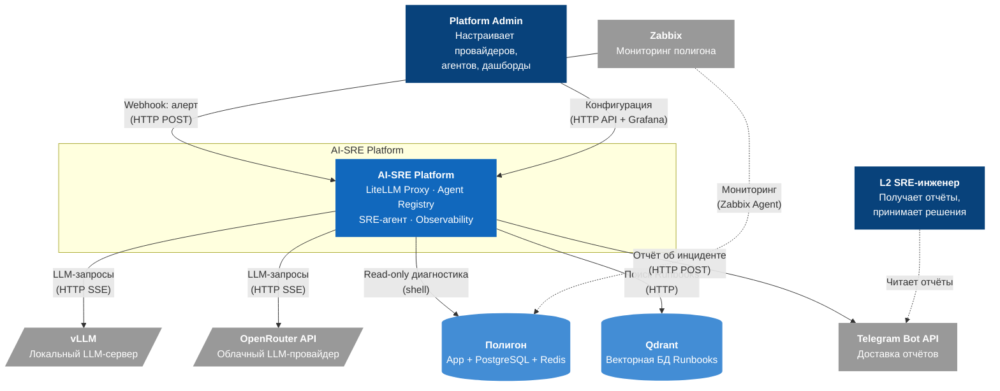

# C4 Context Diagram — AI-SRE Platform

Система, пользователи, внешние сервисы и границы.

## Описание границ

| Граница | Внутри | Снаружи |
|---|---|---|
| **AI-SRE Platform** | LiteLLM Proxy, Registry, SRE-агент, Observability, Guardrails, PostgreSQL, Prometheus, Grafana, Langfuse | — |
| **Внешние сервисы** | — | vLLM (GPU-сервер), OpenRouter (облако), Telegram (облако) |
| **Полигон** | App, PostgreSQL, Redis, Zabbix Agent | Мониторится Zabbix, диагностируется SRE-агентом |
