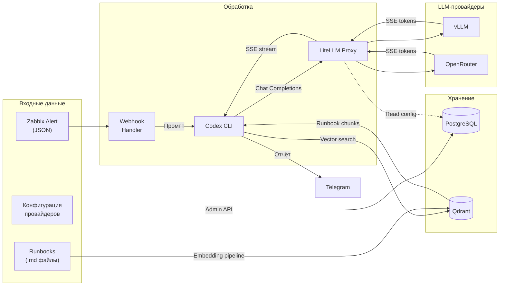
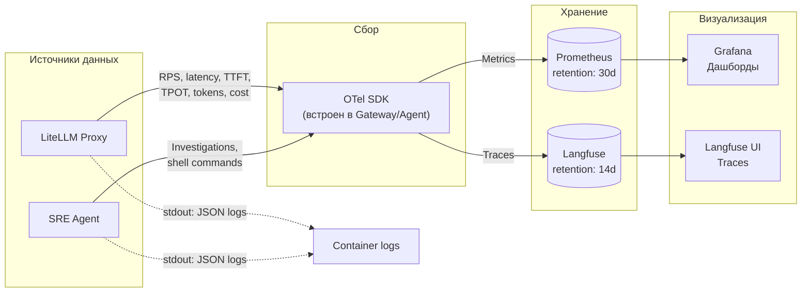

# Data Flow Diagram — AI-SRE Platform

Как данные проходят через систему: что передаётся, что хранится, что логируется. Разделено на два аспекта для читаемости.

## Основной data path (запрос → обработка → результат)

## Observability data path (метрики, логи, трейсы)

## Классификация данных

### Что передаётся (транзитно)

| Данные | Откуда | Куда | Формат |
|---|---|---|---|
| Zabbix alert | Zabbix | Webhook Handler | JSON |
| LLM prompt (messages) | Codex | Gateway → Provider | OpenAI Chat Completions JSON |
| LLM response (tokens) | Provider | Gateway → Codex | SSE (data: JSON chunks) |
| Shell stdout/stderr | Полигон | Codex context | Plain text (truncated 4000 chars) |
| Runbook chunks | Qdrant | Codex context | Plain text |
| Incident report | Codex | Telegram | Markdown |

### Что хранится (persistent)

| Данные | Где | Retention | Формат |
|---|---|---|---|
| LLM deployments, virtual keys, spend | PostgreSQL (LiteLLM DB) | Permanent | Prisma |
| Agent Cards | PostgreSQL (Registry DB) | Permanent | JSONB (A2A spec) |
| Runbook embeddings | Qdrant | Permanent | Vectors + metadata |
| Time-series metrics | Prometheus | 30 дней | TSDB |
| LLM traces | Langfuse | 14 дней | Spans, events |

### Что логируется

| Что | Куда | Зачем |
|---|---|---|
| LLM-запросы: prompt, completion, model, tokens, latency, cost | Langfuse | Трейсинг, cost tracking |
| Tool calls: команда, stdout, duration | Langfuse | Анализ поведения агента |
| RPS, latency p50/p95, TTFT, TPOT, error rate | Prometheus → Grafana | Операционный мониторинг |
| Cooldown state changes | Prometheus + stdout | Alerting |
| Guardrails срабатывания | Langfuse + stdout | Security audit |
| Auth failures | stdout (JSON) | Security audit |
