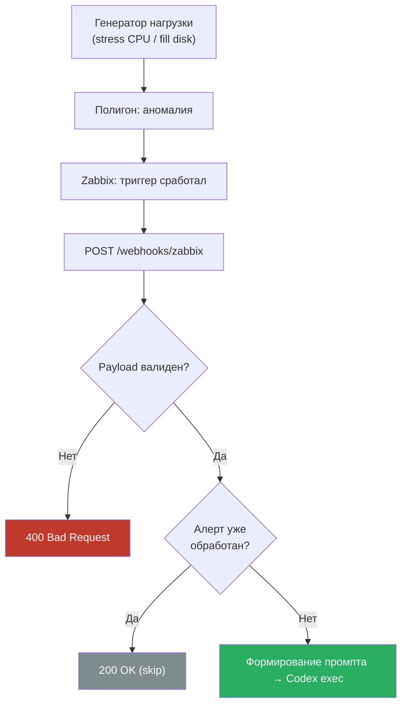
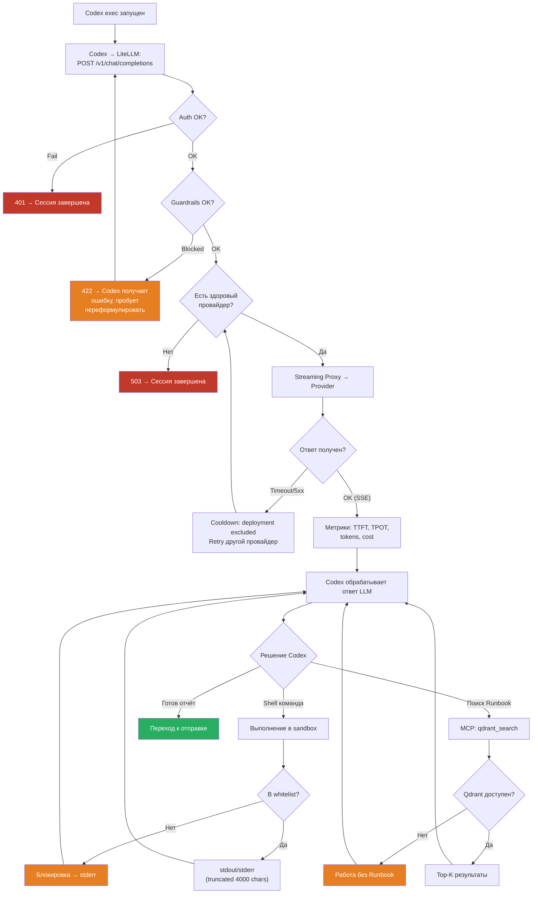
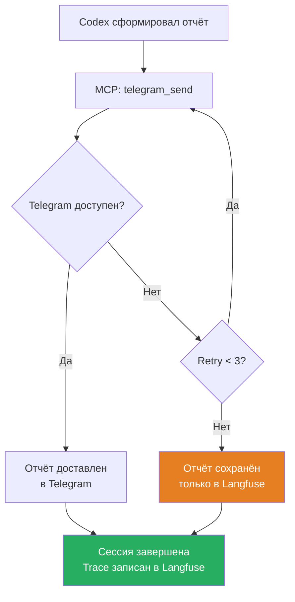

# Workflow Diagram — Обработка инцидента

Пошаговое выполнение запроса. Разбито на три фазы для читаемости.

## Фаза 1: Приём алерта

## Фаза 2: Цикл диагностики (внутри Codex)

## Фаза 3: Отправка отчёта

Таймауты и SLA: [system-design.md](../system-design.md#9-ограничения)
